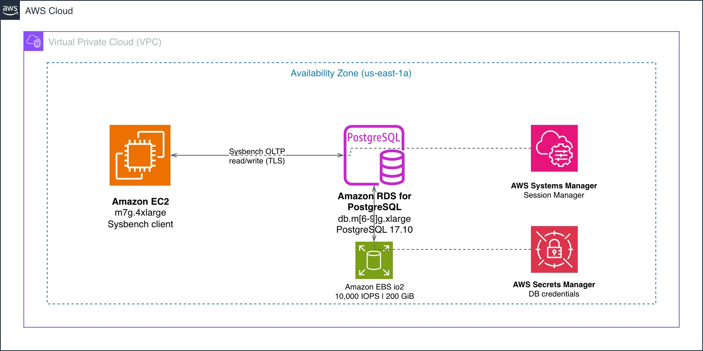

# Amazon RDS Benchmark

CloudFormation template for benchmarking Amazon RDS instance classes using Sysbench OLTP workloads. Deploy, run, compare - no manual setup required.

## Supported Instance Families

| Family | Processor | Generations | Status |
|--------|-----------|-------------|--------|
| M*g | AWS Graviton (Arm) | M6g, M7g, M8g, M9g | Active |
| M*i | Intel (x86) | M5, M6i, M7i | Planned |
| M*a | AMD (x86) | M6a, M7a | Planned |

To add new instance families: uncomment entries in the `AllowedValues` list in the template's `InstanceClass` parameter.

## Related Blog Posts

- [Boosting Amazon RDS with AWS Graviton5: Benchmarks](https://aws.amazon.com/blogs/database/) (2026)
- [Leveling up Amazon RDS with AWS Graviton4: Benchmarks](https://aws.amazon.com/blogs/database/leveling-up-amazon-rds-with-aws-graviton4-benchmarks/) (2025)

## Architecture



The template deploys an Amazon EC2 instance running Sysbench connected to an Amazon RDS instance in the same Availability Zone within a private VPC. All connectivity uses VPC endpoints - no public IPs are required.

## Quick Start

**1. Deploy the stack**

```bash
aws cloudformation create-stack \
  --stack-name rds-bench-m9g \
  --template-body file://rds-benchmark.yaml \
  --parameters ParameterKey=InstanceClass,ParameterValue=db.m9g.xlarge \
               ParameterKey=DatabaseEngine,ParameterValue=postgres \
  --capabilities CAPABILITY_NAMED_IAM \
  --region us-east-1
```

**2. Wait for deployment (~15 minutes)**

```bash
aws cloudformation wait stack-create-complete --stack-name rds-bench-m9g --region us-east-1
```

**3. Connect to the EC2 instance**

Get the Session Manager URL from the stack outputs:

```bash
aws cloudformation describe-stacks --stack-name rds-bench-m9g --region us-east-1 \
  --query "Stacks[0].Outputs[?OutputKey=='SessionManagerURL'].OutputValue" --output text
```

Open the URL in your browser, or connect via CLI:

```bash
aws ssm start-session --target <instance-id> --region us-east-1
```

**4. Run the benchmark**

```bash
/opt/run-benchmark.sh
```

The script runs the full benchmark automatically (approximately 35 minutes). Results are saved to `/opt/results/`.

**5. Cleanup**

```bash
aws cloudformation delete-stack --stack-name rds-bench-m9g --region us-east-1
```

## What the Stack Creates

| Resource | Description |
|----------|-------------|
| VPC | Private VPC with a subnet in a single Availability Zone |
| Amazon RDS DB instance | Running the selected engine and instance class (Single-AZ) |
| Amazon EC2 instance | m7g.4xlarge with Sysbench pre-installed and benchmark script |
| VPC endpoints | AWS Systems Manager Session Manager (private connectivity) |
| AWS Secrets Manager secret | Database credentials (auto-generated, no hardcoded passwords) |
| IAM roles | Least-privilege roles for Session Manager access |
| Parameter group | Enforces TLS connections |
| Amazon EBS io2 volume | 200 GiB with 10,000 provisioned IOPS attached to the RDS instance |

## Parameters

| Parameter | Description | Default | Allowed Values |
|-----------|-------------|---------|----------------|
| `DatabaseEngine` | Database engine to benchmark | `postgres` | `postgres`, `mysql`, `mariadb` |
| `InstanceClass` | RDS instance class | `db.m8g.xlarge` | See template for full list |
| `SysbenchTables` | Number of tables | `2` | 1-64 |
| `SysbenchTableSize` | Rows per table | `2000000` | 10000+ |
| `SysbenchThreads` | Concurrent threads | `100` | 1-512 |
| `SysbenchDuration` | Duration in seconds | `1800` | 60+ |

## What the Benchmark Script Does

The `/opt/run-benchmark.sh` script automates the full Sysbench workflow:

1. **Prepare** - Creates tables with the configured row count
2. **Run** - Executes the `oltp_read_write` workload, reporting metrics every 10 seconds
3. **Cleanup** - Drops the test tables after the run completes
4. **Save results** - Writes the full Sysbench output to `/opt/results/` with a timestamped filename

The script retrieves database credentials from Secrets Manager automatically and connects over TLS. No manual configuration is needed.

## Benchmark Configuration

| Parameter | Value |
|-----------|-------|
| Workload | `oltp_read_write` |
| Tables | 2 (default) |
| Rows per table | 2,000,000 (default) |
| Threads | 100 (default) |
| Duration | 1,800s / 30 min (default) |
| Reporting | Every 10 seconds |
| TLS | Enforced (all engines) |

## Extending for New Processors

When a new instance family becomes available on RDS:

1. Add the instance class to `AllowedValues` in the template
2. If x86: update `LatestAmiId` default or add a condition for x86 AMI
3. Deploy a new stack with the new instance class
4. Compare results

No template restructuring needed.

## Security

- No public IPs on any resource
- All connectivity via VPC endpoints
- TLS enforced on all database connections
- Credentials stored in Secrets Manager (never hardcoded)
- Least-privilege IAM roles

## Cost

**Warning:** This stack costs approximately **$2.17/hour ($52/day)** while running. Delete the stack immediately after collecting benchmark results.

| Resource | Hourly Cost (us-east-1) |
|----------|------------------------|
| RDS instance (db.m8g.xlarge) | $0.58 |
| io2 200 GiB + 10,000 IOPS | $0.92 |
| EC2 m7g.4xlarge | $0.58 |
| NAT Gateway | $0.045 |
| VPC Endpoints (x4) | $0.04 |

Costs vary by instance class. Run `aws cloudformation delete-stack` as soon as you have your results.

## License

This library is licensed under the MIT-0 License. See the LICENSE file.
